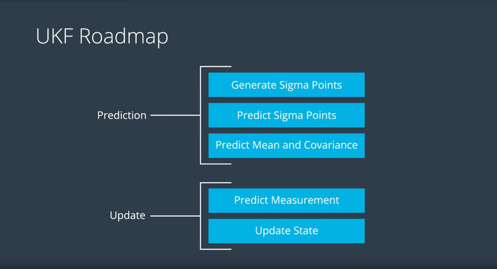
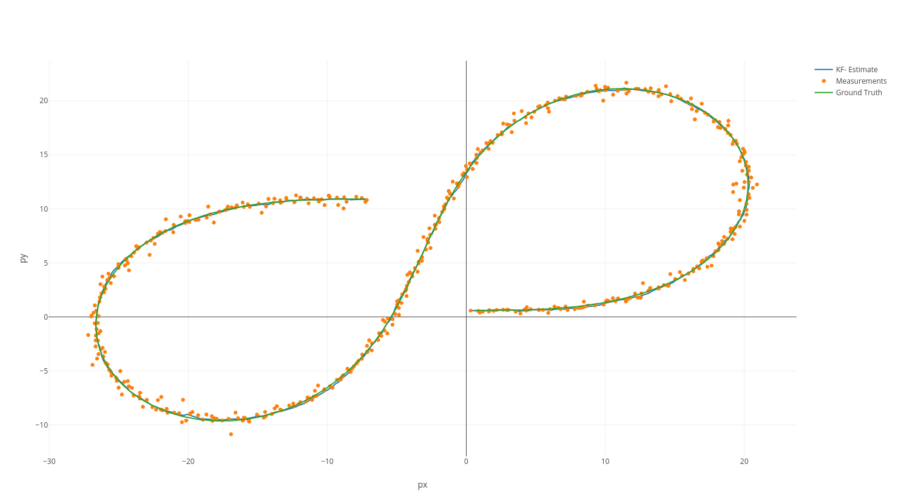

Self-Driving Car Engineer Nanodegree Program

Description
-----------

This project implements a sensor fusion algorithm that merges noisy Lidar and
Radar measurements of a moving object of interest from a self driving car
perspective, leveraging on the Unscented Kalman Filter tecnique. Measurements
come from a simulator that will show the object real position, the measurements,
the estimates, and the root mean square error of the estimates. The simulator
can be downloaded
[here](https://github.com/udacity/self-driving-car-sim/releases).

The communication with the simulator is based on uWebSocketIO. The repository
includes two files that can be used to set up and install
[uWebSocketIO](https://github.com/uWebSockets/uWebSockets) for either Linux or
Mac systems. For windows you can use either Docker, VMware, or even [Ubuntu bash
on Windows
10](https://www.howtogeek.com/249966/how-to-install-and-use-the-linux-bash-shell-on-windows-10/)
to install uWebSocketIO.

Once the install for uWebSocketIO is complete, the main program can be built and
run by doing the following from the project top directory.

 

1.  mkdir build

2.  cd build

3.  cmake ..

4.  make

5.  ./UnscentedKF

 

Basic Build Instructions
------------------------

1.  Clone this repo.

2.  Make a build directory: `mkdir build && cd build`

3.  Compile: `cmake .. && make`

    -   On windows, you may need to run: `cmake .. -G "Unix Makefiles" && make`

4.  Run it: `./UnscentedKF`

 

Dependencies
------------

-   cmake \>= 3.5

    -   All OSes: [click here for installation
        instructions](https://cmake.org/install/)

-   make \>= 4.1 (Linux, Mac), 3.81 (Windows)

    -   Linux: make is installed by default on most Linux distros

    -   Mac: [install Xcode command line tools to get
        make](https://developer.apple.com/xcode/features/)

    -   Windows: [Click here for installation
        instructions](http://gnuwin32.sourceforge.net/packages/make.htm)

-   gcc/g++ \>= 5.4

    -   Linux: gcc / g++ is installed by default on most Linux distros

    -   Mac: same deal as make - [install Xcode command line
        tools](https://developer.apple.com/xcode/features/)

    -   Windows: recommend using [MinGW](http://www.mingw.org/)

 

Implementation design
---------------------

The process chain of a UKF algorithm is the following:

While an EKF deals with non-linearities (e.g. in the radar step update) by means
of linearization, UKF leverages on Sigma points generation and prediction, to
approximate a non-gaussian distribution, with a gaussian one and determine its
mean and covariance values. Furthermore, on the contrary of the EKF project, in
this project the movement model is CTRV (Constant Turn Rate Velocity), meaning
that between step `k` and `k+1` in our model the object can move with constant
turn rate.

In the `./src/`folder following files are worth of mention:

-   `kalman_filter.h`

    Kalman Filter interface with its 3 methods: `init,predict,update`

    -   `fusion_estimator.cpp`

        Abstract class for a generic estimator that fuses Lidar and Radar
        measurement. Subclasses must implement `GetEstimate(const
        MeasurementPackage &measurement_pack)`but since the RMSE logic is
        indipendent from the implementation of the estimator, the method
        `CalculateRMSE(const vector<VectorXd> &estimations, const
        vector<VectorXd> &ground_truth)` is already implemented here

    -   `fusion_ukf.cpp`

        Unscented Kalman Filter that fuses Radar and Lidar. Sigma points are
        used for the prediction step, standard KF equations are used for Lidar
        updates, and for Radar updates the predicted sigma points are mapped
        into measurement space. Modifying the proper flag in the constructor
        makes possible to exclude one of the two sensors. It also stores the NIS
        values for Radar and Lidar. These values have been used to fine tune the
        process noise standard deviation for the tangential acceleration `std_a`
        and for the yaw accelaration `std_yawdd`

        It implements `kalman_filter.h` and inherits `fusion_estimator.h`

    -   `main.cpp`

        Application entry point. Receives via [uWebSocketIO] the sensor
        measurements, calls the estimator and returns to the simulator the
        estimates and the calculated RMSE. Eventually it saves also the results
        in a file

 

This design is a good starting point towards a bridge pattern that hides and
separates the implementation of a generic state (position and velocity)
estimator (EKF, UKF, et others), and its interface. Methods are structured in a
way to follow good object oriented practices to make the code readable and
reusable, without significant overhead.

### Functional programming design challenges

The nature of the Kalman Filter (processing a list of values in a sequential
way, keeping an implicit dependency in its state of all values processed in the
past) suggests that a Functional programming (leveraging for instance on a fold
operation) approach could be natural to implement the algorithm, as illustrated
by John D. Cook
[here](https://www.johndcook.com/blog/2016/07/14/kalman-filters-and-functional-programming/).

However, C++ is not designed as a functional programming language (and
completely far away from a pure functional one like Haskell). In fact C++ 11
supports only a few functional programming constructs
([here](http://blog.madhukaraphatak.com/functional-programming-in-c++/) they
are). To make the language flexible enough to emulate the control flow switch
between the accumulator function (fold) that implements the Kalman and the
function that reads the measurement when they arrive,
[Coroutines](https://www.boost.org/doc/libs/1_67_0/libs/coroutine2/doc/html/index.html)
of the Boost library would be necessary. This would bring massive overhead in
terms of readability and more importantly performance, as a result of forcing an
object oriented language to behave like a functional one.

Besides the limitations of C++, at the moment a functional programming approach
is strongly discouraged given that functional programming languages do not have
spatial and time complexity bounds known in advance given a fixed algorithm,
making them inappropriate for real time systems
([here](https://pdfs.semanticscholar.org/c5ea/0ee9cfd64991d3b2acaa54ec439e9a172b5b.pdf)an
article about the topic).

Estimation results
------------------

After fine tuning the initial mean state and covariance values to setup the
Kalman filter, the process noises `std_a` and `std_yawdd` the final values for
the root mean square error at the end of the simulation are:

`x: 0.0594`

`y: 0.0872`

`Vx: 0.1432`

`Vy: 0.1977`

(these values could slightly change depending on the platform)

Leveraging also on these [Visualization
Utilities](https://github.com/udacity/CarND-Mercedes-SF-Utilities) provided by
Mercedes I was able to plot the ground truth values, the sensors measurements
and the estimates for the object position over time:

[Interactive plot](https://plot.ly/~paneand/9)

Compared to the [EKF
implementation](https://github.com/paneand/CarND-Extended-Kalman-Filter-Project),
the UKF provides significantly better results in terms of velocity RMSE, which
unfortunately cannot be seen in this plot. Next enhancements could be:

-   Evaluate the estimates of the UKF using only Radar or Lidar

-   Plot also the velocity estimates and ground truth values for comparison
